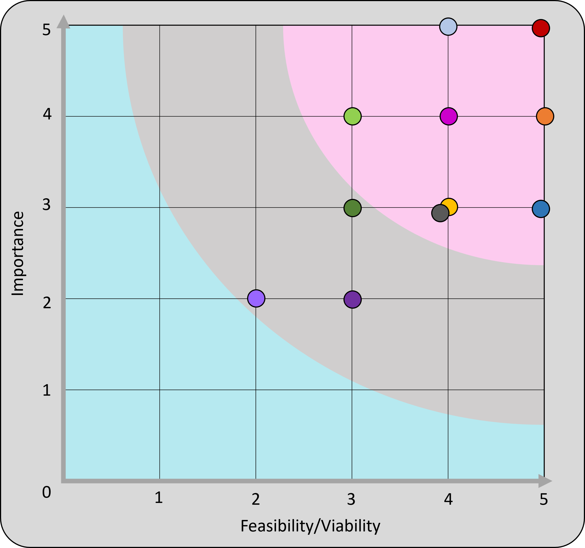

<h1 id="top"><a href="https://startrek-timeloop.herokuapp.com/">Star Trek: Time Loop</a></h1>

## Contents
<ul>
    <li>
        <a href="#Introduction"><strong>Introduction</strong></a>
    </li>
    <li>
        <a href="#UX"><strong>UX</strong></a>               
    </li>
    <li>
        <a href="#Technologies"><strong>Technologies</strong></a>
    </li>
    <li>
        <a href="#Features"><strong>Features</strong></a>
    </li>
    <li>
        <a href="#Testing"><strong>Testing</strong></a>   
    </li>
    <li>
        <a href="#Deployment"><strong>Deployment</strong></a>
    </li>
    <li>
       <a href="#Credits"><strong>Credits</strong></a> 
    </li>
    <li>
        <a href="#Screenshots"><strong>Screenshots</strong></a>
    </li>
    <li>
        <a href="#References"><strong>References</strong></a>
    </li>
</ul>

# Introduction
Portfolio Project Three: Python - Code Institute - Deadline 17th September 2021

This is my submission for Code Institute's (5P) Portfolio Project Three. It will be a text based Python game where the user will navagate a series of rooms, each room having an effect on the user (an increase/decrease in health, item pick ups, instant death or a game win). For the user to 'win' the game they must have all the required equipment and a health score which is a positive number (a negative health will automatically result in death). The game will be deployed via Heroku and will be purely terminal based for user interaction. The intitial idea for the theme of the game is 'space' where a space ship has interacted with a space-time anomaly, the ship has suffered huge damage and the user has woken up in the engine room. I want to try and simulate a time-loop scenario by having most of the rooms interconnected to make it easier for the user to go round in circles and have the same interaction multiple times.  

### Demo
A live of the website can be found <a href="https://startrek-timeloop.herokuapp.com/">**HERE**</a>  
  
<a href="#top">Back to the top.</a>

<h1 id="UX">UX - Five Planes</h1> 
I have found the use of the five planes model to be highly useful in the development of my previous projects, although this Python Project doesn't employ the use of HTML or CSS as much as the previous projects and therefore is far less visual and intuitive, I still want the overall experience of the user to be positive and as such I am going to try and follow the five planes model to try and ensure all user needs are met.

### Strategy
#### Vision

Star Trek: Time Loop is an interactive game focusing on the users interactions with the space ship and the choices they make to determine which direction they go in. These choices will result in scenarios where the user will get an increase in their health, a decrease in their health, instant death, or an item pickup. The theme of the game is futuristic/space and is highly influenced by the Star Trek franchise. Although the user doesn't have to know anything about Star Trek - the users that are familier with it may find small snippets of information that they are familiar with such as some of the interactions that cause health depletions. I have a personal connection with the Star Trek franchise as I am named after Deanna Troi in Star Trek: The Next Generation, so creating this game will be an enjoyable process for me and I hope that will reflect in the quality of the code and the story line. Before I started writing any code I first used <a href="https://www.canva.com/create/mood-boards/"><strong>CANVA</strong></a> to create a mood board to get me thinking about space and give me some ideas about what I might want the user to visualise through the story line (and perhaps change the visual asthetics of the hosted website). This was the mood board I created:
 
From here, I then went on to think about the layout of the game. I don't want the user to be too restricted in their choices and as such I chose to have quite a few rooms in the whole map (25 to be exact). As you can see from the graphic below (made with <a href="https://www.lucidchart.com/pages/"><strong>LUCID CHART</strong></a> and then imported into PowerPoint for final alterations) the map is grid-based however the paths between rooms are not always linear. Certain paths will skip rooms, others will move diagonally and only a few paths will allow the user to back-track into the room they were in before. By not always having straightforward paths this allows me the creative freedom to implement features that would represent situations such as time-loops and space-time anomalies.
 
Once I had a layout I was happy with, I then went on to decide the interactions for each room. I wanted these to become predictable for the user so I have almost made a mirror image of the two halves of the map with the Engine Bay being the focal point. As the user moves from room to room, it is my hope that they will become familier with the various paths and learn from mistakes/achievements. The graphic below shows the room names as well as what will happen in these rooms.
 

#### Aims
<ol>
    <li>To supply instructions to the user on how to best play the game</li>
    <li>For visitors to the website to have a positive user experience, in terms of website design and interactivity</li>
    <li>For the game to be easily playable by the user (but not necessarily easy to win!)</li>
    <li>To give the user the choice to have some background music to help with the visualisation and theme of the game</li>
</ol>

#### Target Audience
The original series of Star Trek, which aired in the late 1960s, has since spawned nine successor series totalling 38 seasons/799 episodes and thirteen movies as of August 2020[1]. The total screen time is just under 652 hours[2]. Due to the huge amount of content produced over more than 60 years, the fan base for the Star Trek franchise is vast - men and women of all ages have been found to be fans of the franchise.
Although the Star Trek Time Loop game is greatly influenced by Star Trek, I don't want it to be purely for the star trek fan-base, I want it to be appealing to anyone that has an interest in science fiction as Star Trek knowledge isn't needed to be able to play.

#### User Stories
##### As a new and returning user I want to...
<ul>
    <li>Know the theme of the game as soon as I navigate to the landing page</li>
    <li>Navigate the website quickly and effectively</li>
    <li>Quickly find the relevant information I need to be able to play the game</li>
    <li>Have an interesting and in-depth story line to make the game more interesting</li>
</ul>

##### As the developer I want to...
<ul>
    <li>Ensure the game is easily maintainable by software developers by having intutitive and neat code</li>
    <li>Have any media content displayed in the website accessible at all times via a linked file system</li>
    <li>Ensure all navigation links (internal or external) are always fully functional for ease of use</li>
</ul>

#### What's in and what's out?

<table>
    <tr>
        <th>Opportunity/Feature</th>
        <th>Feasibility/Viability (score out of 5)</th>
        <th>Level of Importance (score out of 5)</th>
        <th>In or out?</th>
    </tr>
    <tr>
        <td>Obvious role of the website demonstrated theme image and game title text and favicon</td>
        <td>5</td>
        <td>5</td>
        <td>In</td>
    </tr>
    <tr>
        <td>Simple design with straightforward navigation to make it easier for the user to understand where to find information such as game instructions</td>
        <td>5</td>
        <td>4</td>
        <td>In</td>
    </tr>
    <tr>
        <td>A fully responsive website that works on a range of screen sizes and devices</td>
        <td>4</td>
        <td>3</td>
        <td>In</td>
    </tr>
    <tr>
        <td>For gameplay: A way of increasing/decreasing the player's health and a way to track this</td>
        <td>3</td>
        <td>4</td>
        <td>In</td>
    </tr>
    <tr>
        <td>For gameplay: Have a number of interactions that must be achieved before the player can 'win'</td>
        <td>3</td>
        <td>3</td>
        <td>Maybe In</td>
    </tr>
    <tr>
        <td>For gameplay: Have a way of conveying events such as time-loops by having the user go round in circles</td>
        <td>4</td>
        <td>5</td>
        <td>In</td>
    </tr>
    <tr>
        <td>For gameplay: Have interactions update depending on whether other interactions have taken place</td>
        <td>5</td>
        <td>3</td>
        <td>In</td>
    </tr>
    <tr>
        <td>For gameplay: Have a way to make the game easier or harder before the player starts the game</td>
        <td>3</td>
        <td>2</td>
        <td>Out</td>
    </tr>
    <tr>
        <td>For gameplay: To have an element of chance for each room to have a random interaction</td>
        <td>2</td>
        <td>2</td>
        <td>Out</td>
    </tr>
    <tr>
        <td>For gameplay: To have a different interaction per room</td>
        <td>4</td>
        <td>4</td>
        <td>In</td>
    </tr>
    <tr>
        <td>For gameplay: To have a different interaction depending on what path the user takes from one room to the next</td>
        <td>4</td>
        <td>3</td>
        <td>In</td>
    </tr>
    <tr>
        <td></td>
        <td>Average Viability x number of features: 42</td>
        <td>Sum of Importance: 39</td>
        <td></td>
    </tr>
</table> 
As we can see from the table above, the viability is higher than the importance, which is good because that means most of the features are able to be implemented, however we must be careful not to implemnt features that would be unneccessary for the game. I must also be careful to stay within the scope of my own coding limitations - implementing features that I have no knowledge or experience of could cause a high liklihood of bugs and errors in the game which would in turn reduce the potential of a positive user experience.
I have plotted the table above into a graph to easily visualise the features that will be implemented into the game and which ones won't be:
<ul>
    <li>The features in the pink section will be implemented</li>
    <li>The features in the grey section could be implemented at a later date but aren't necessary right now</li>
    <li>The features in the turquoise section will not be implemented as it would be unwise to focus on these features until a later date</li>
</ul>
 
 

### Scope

### Structure
### Skeleton
 

### Surface
#### Typography
#### Color Scheme
#### Icons
#### Images
<a href="#top">Back to the top.</a>

# Technologies
### Languages
### Version Control
### Applications
### Frameworks, Libraries & Programs
<a href="#top">Back to the top.</a>

# Features
### Deciding what to implement
### Implemented Features
### Features left to implement
<a href="#top">Back to the top.</a>

# Testing
### Functionality
 
 

### Compatability
### User testing stories
### Code Validation
### Peer Review
### Development Problems
### Accessibility
### Performance Testing
### Bugs & Fixes
<a href="#top">Back to the top.</a>

# Deployment
### Project Creation
### Project Deployment
### Local Deployment
<a href="#top">Back to the top.</a>

# Credits
### Code
### Content
#### Images
#### Audio/Video

### Acknowledgements
<a href="#top">Back to the top.</a>

# Screenshots
<a href="#top">Back to the top.</a>
 

# References
<a href="#top">Back to the top.</a>

25/8 https://en.wikipedia.org/wiki/Lists_of_Star_Trek_episodes
25/8 https://redshirtsalwaysdie.com/2021/01/22/take-far-longer-watch-star-trek-think/

