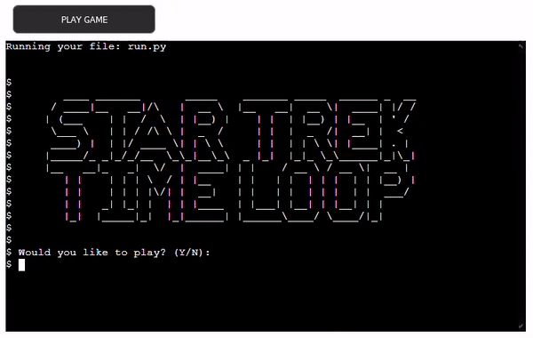
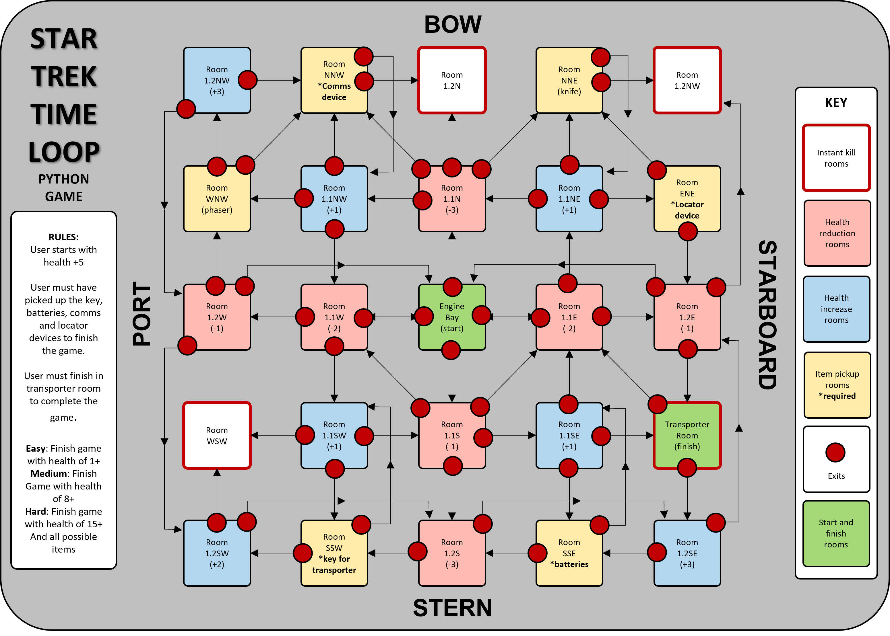
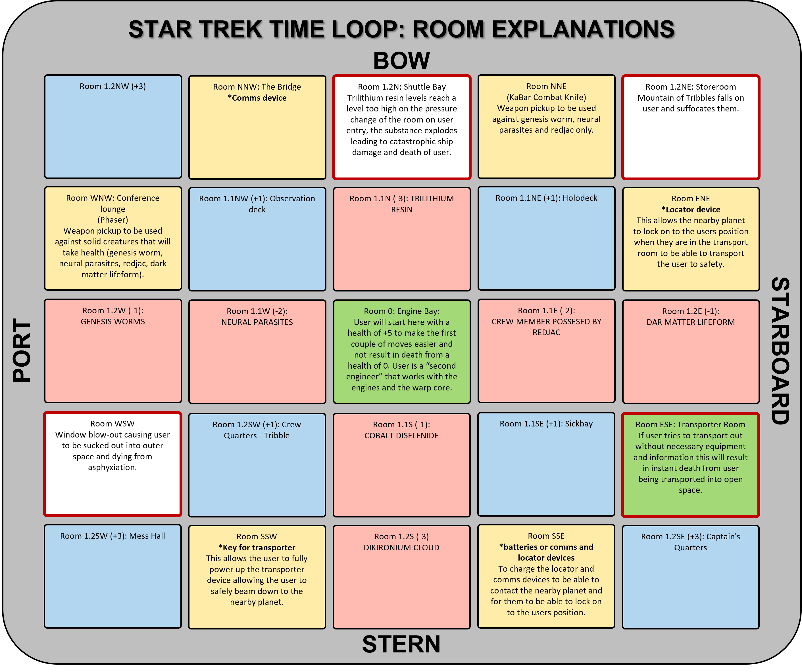
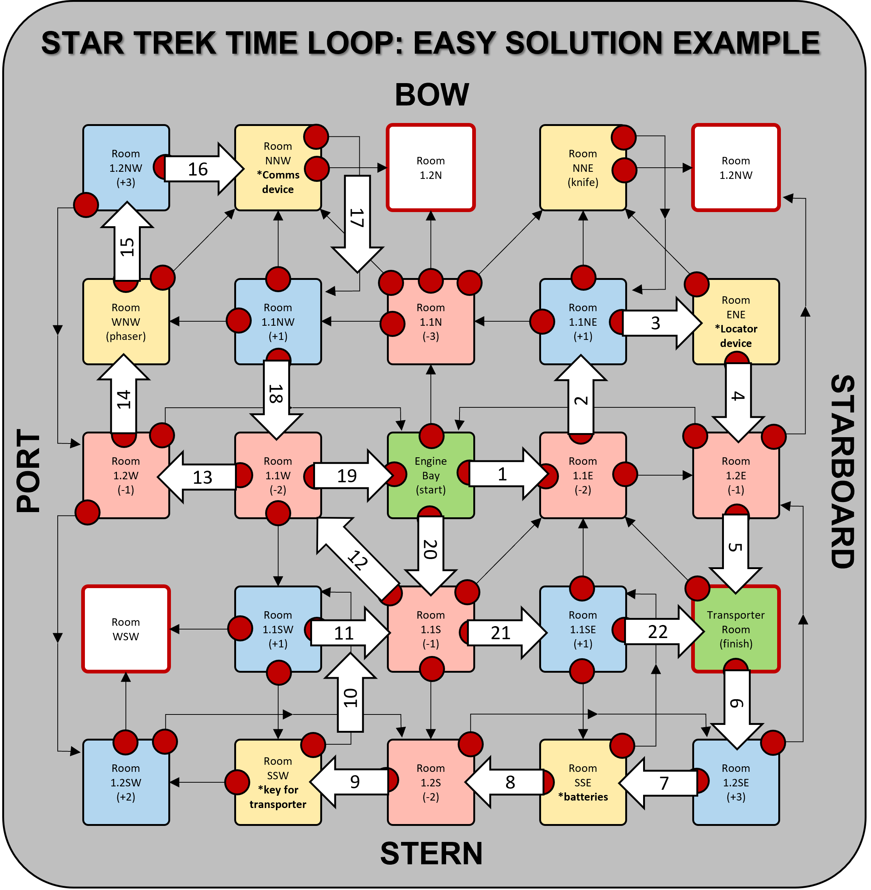
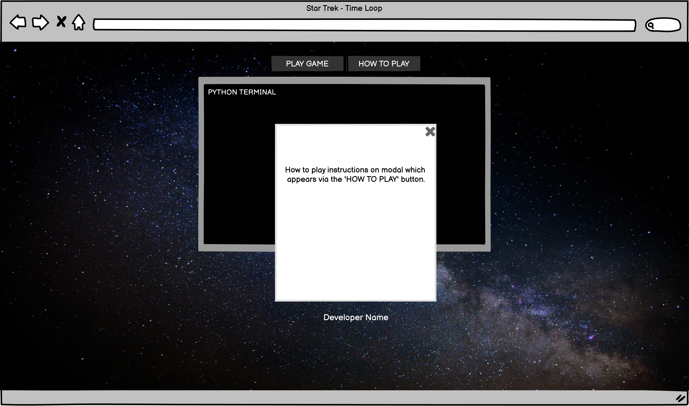
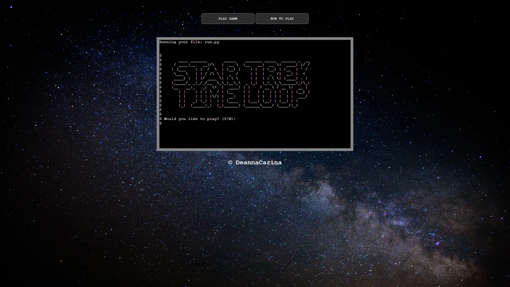

<h1 id="top"><a href="https://startrek-timeloop.herokuapp.com/">Star Trek: Time Loop</a></h1>

## Contents
<ul>
    <li>
        <a href="#Introduction"><strong>Introduction</strong></a>
    </li>
    <li>
        <a href="#UX"><strong>UX</strong></a>               
    </li>
    <li>
        <a href="#Technologies"><strong>Technologies</strong></a>
    </li>
    <li>
        <a href="#Features"><strong>Features</strong></a>
    </li>
    <li>
        <a href="#Testing"><strong>Testing</strong></a>   
    </li>
    <li>
        <a href="#Deployment"><strong>Deployment</strong></a>
    </li>
    <li>
       <a href="#Credits"><strong>Credits</strong></a> 
    </li>
    <li>
        <a href="#Screenshots"><strong>Screenshots</strong></a>
    </li>
    <li>
        <a href="#References"><strong>References</strong></a>
    </li>
</ul>

# Introduction
Portfolio Project Three: Python - Code Institute - Deadline 17th September 2021

This is my submission for Code Institute's (5P) Portfolio Project Three. It will be a text based Python game where the user will navagate a series of rooms, each room having an effect on the user (an increase/decrease in health, item pick ups, instant death or a game win). For the user to 'win' the game they must have a score above 10 (the score will become more fitting to the design and theme of the game e.g. a charge of an exit method). The game will be deployed via Heroku and will be purely terminal based for user interaction. The intitial idea for the theme of the game is 'space' where a space ship has interacted with a space-time anomaly, the ship has suffered huge damage and the user has woken up in the engine room. I want to try and simulate a time-loop scenario by having most of the rooms interconnected to make it easier for the user to go round in circles and have the same interaction multiple times.  

### Demo
A live of the website can be found <a href="https://startrek-timeloop.herokuapp.com/">**HERE**</a>  
  
<a href="#top">Back to the top.</a>

<h1 id="UX">UX - Five Planes</h1> 
I have found the use of the five planes model to be highly useful in the development of my previous projects, although this Python Project doesn't employ the use of HTML or CSS and therefore is far less visual and intuitive, I still want the overall experience of the user to be positive and as such I am going to try and follow the five planes model to try and ensure all user needs are met.

### Strategy
#### Vision
 
 
 
 

#### Aims
#### Target Audience
#### User Stories
##### As a new and returning user
##### As the developer
#### What's in and what's out?
### Scope
### Structure
### Skeleton
 

### Surface
#### Typography
#### Color Scheme
#### Icons
#### Images
<a href="#top">Back to the top.</a>

# Technologies
### Languages
### Version Control
### Applications
### Frameworks, Libraries & Programs
<a href="#top">Back to the top.</a>

# Features
### Deciding what to implement
### Implemented Features
### Features left to implement
<a href="#top">Back to the top.</a>

# Testing
### Functionality
### Compatability
### User testing stories
### Code Validation
### Peer Review
### Development Problems
### Accessibility
### Performance Testing
### Bugs & Fixes
<a href="#top">Back to the top.</a>

# Deployment
### Project Creation
### Project Deployment
### Local Deployment
<a href="#top">Back to the top.</a>

# Credits
### Code
### Content
#### Images
### Acknowledgements
<a href="#top">Back to the top.</a>

# Screenshots
<a href="#top">Back to the top.</a>
 

# References
<a href="#top">Back to the top.</a>

