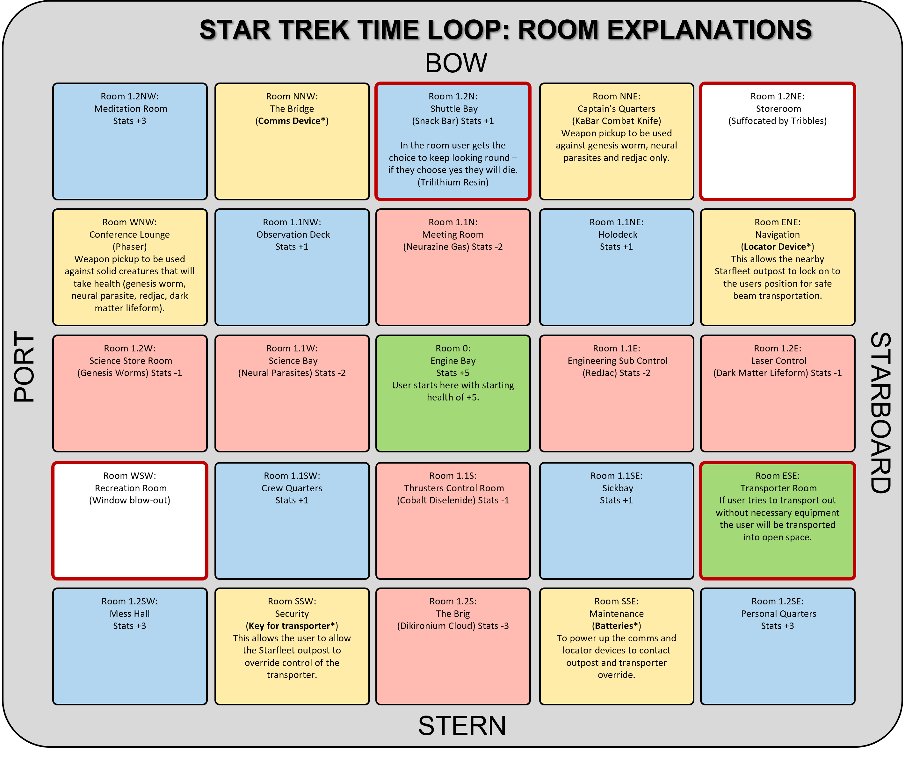

<h1 id="top"><a href="https://startrek-timeloop.herokuapp.com/">Star Trek: Time Loop</a></h1>

## Contents
<ul>
    <li>
        <a href="#Introduction"><strong>Introduction</strong></a>
    </li>
    <li>
        <a href="#UX"><strong>UX</strong></a>               
    </li>
    <li>
        <a href="#Technologies"><strong>Technologies</strong></a>
    </li>
    <li>
        <a href="#Features"><strong>Features</strong></a>
    </li>
    <li>
        <a href="#Testing"><strong>Testing</strong></a>   
    </li>
    <li>
        <a href="#Deployment"><strong>Deployment</strong></a>
    </li>
    <li>
       <a href="#Credits"><strong>Credits</strong></a> 
    </li>
    <li>
        <a href="#Screenshots"><strong>Screenshots</strong></a>
    </li>
    <li>
        <a href="#References"><strong>References</strong></a>
    </li>
</ul>

# Introduction
Portfolio Project Three: Python - Code Institute - Deadline 17th September 2021

This is my submission for Code Institute's (5P) Portfolio Project Three. It will be a text based Python game where the user will navagate a series of rooms, each room having an effect on the user (an increase/decrease in health, item pick ups, instant death or a game win). For the user to 'win' the game they must have all the required equipment and a health score which is a positive number (a negative health will automatically result in death). The game will be deployed via Heroku and will be purely terminal based for user interaction. The intitial idea for the theme of the game is 'space' where a space ship has interacted with a space-time anomaly, the ship has suffered huge damage and the user has woken up in the engine room. I want to try and simulate a time-loop scenario by having most of the rooms interconnected to make it easier for the user to go round in circles and have the same interaction multiple times.  

### Demo
A live of the website can be found <a href="https://startrek-timeloop.herokuapp.com/">**HERE**</a>  
  
<a href="#top">Back to the top.</a>

<h1 id="UX">UX - Five Planes</h1> 
I have found the use of the five planes model to be highly useful in the development of my previous projects, although this Python Project doesn't employ the use of HTML or CSS as much as the previous projects and therefore is far less visual and intuitive, I still want the overall experience of the user to be positive and as such I am going to try and follow the five planes model to try and ensure all user needs are met.

### Strategy
#### Vision

Star Trek: Time Loop is an interactive game focusing on the users interactions with the space ship and the choices they make to determine which direction they go in. These choices will result in scenarios where the user will get an increase in their health, a decrease in their health, instant death, or an item pickup. The theme of the game is futuristic/space and is highly influenced by the Star Trek franchise. Although the user doesn't have to know anything about Star Trek - the users that are familier with it may find small snippets of information that they are familiar with such as some of the interactions that cause health depletions. I have a personal connection with the Star Trek franchise as I am named after Deanna Troi in Star Trek: The Next Generation, so creating this game will be an enjoyable process for me and I hope that will reflect in the quality of the code and the story line. Before I started writing any code I first used <a href="https://www.canva.com/create/mood-boards/"><strong>CANVA</strong></a> to create a mood board to get me thinking about space and give me some ideas about what I might want the user to visualise through the story line (and perhaps change the visual asthetics of the hosted website). This was the mood board I created:
 
From here, I then went on to think about the layout of the game. I don't want the user to be too restricted in their choices and as such I chose to have quite a few rooms in the whole map (25 to be exact). As you can see from the graphic below (made with <a href="https://www.lucidchart.com/pages/"><strong>LUCID CHART</strong></a> and then imported into PowerPoint for final alterations) the map is grid-based however the paths between rooms are not always linear. Certain paths will skip rooms, others will move diagonally and only a few paths will allow the user to back-track into the room they were in before. By not always having straightforward paths this allows me the creative freedom to implement features that would represent situations such as time-loops and space-time anomalies.
 
Once I had a layout I was happy with, I then went on to decide the interactions for each room. I wanted these to become predictable for the user so I have almost made a mirror image of the two halves of the map with the Engine Bay being the focal point. As the user moves from room to room, it is my hope that they will become familier with the various paths and learn from mistakes/achievements. The graphic below shows the room names as well as what will happen in these rooms.
 

#### Aims
#### Target Audience
#### User Stories
##### As a new and returning user
##### As the developer
#### What's in and what's out?
### Scope
### Structure
### Skeleton
 

### Surface
#### Typography
#### Color Scheme
#### Icons
#### Images
<a href="#top">Back to the top.</a>

# Technologies
### Languages
### Version Control
### Applications
### Frameworks, Libraries & Programs
<a href="#top">Back to the top.</a>

# Features
### Deciding what to implement
### Implemented Features
### Features left to implement
<a href="#top">Back to the top.</a>

# Testing
### Functionality
 
 

### Compatability
### User testing stories
### Code Validation
### Peer Review
### Development Problems
### Accessibility
### Performance Testing
### Bugs & Fixes
<a href="#top">Back to the top.</a>

# Deployment
### Project Creation
### Project Deployment
### Local Deployment
<a href="#top">Back to the top.</a>

# Credits
### Code
### Content
#### Images
#### Audio/Video

### Acknowledgements
<a href="#top">Back to the top.</a>

# Screenshots
<a href="#top">Back to the top.</a>
 

# References
<a href="#top">Back to the top.</a>

