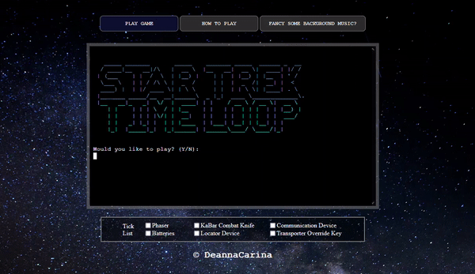
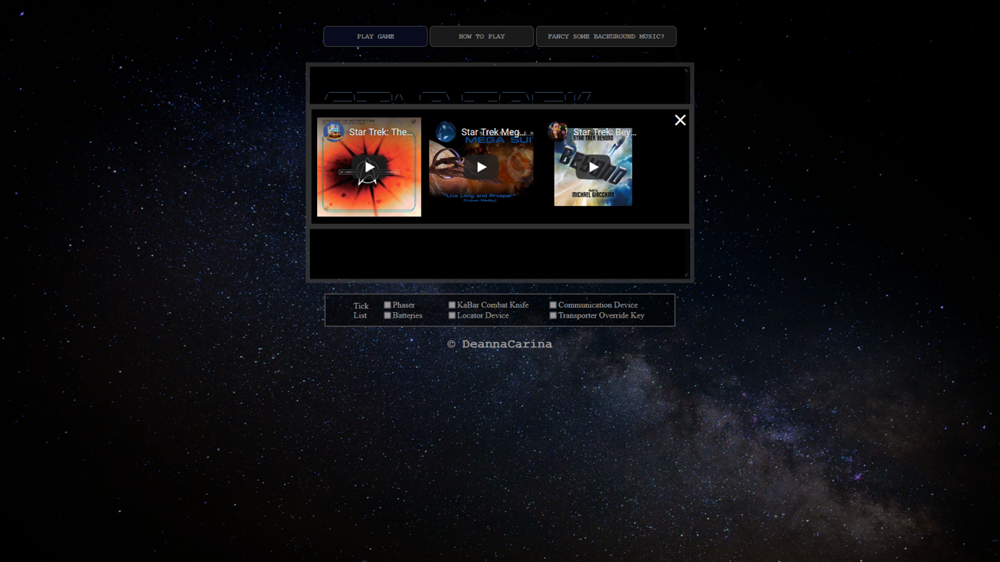

<h1 id="top"><a href="https://startrek-timeloop.herokuapp.com/">Star Trek: Time Loop</a></h1>

## Contents
<ul>
    <li>
        <a href="#Introduction"><strong>Introduction</strong></a>
    </li>
    <li>
        <a href="#UX"><strong>UX</strong></a>               
    </li>
    <li>
        <a href="#Technologies"><strong>Technologies</strong></a>
    </li>
    <li>
        <a href="#Features"><strong>Features</strong></a>
    </li>
    <li>
        <a href="#Testing"><strong>Testing</strong></a>   
    </li>
    <li>
        <a href="#Deployment"><strong>Deployment</strong></a>
    </li>
    <li>
       <a href="#Credits"><strong>Credits</strong></a> 
    </li>
    <li>
        <a href="#Screenshots"><strong>Screenshots</strong></a>
    </li>
    <li>
        <a href="#References"><strong>References</strong></a>
    </li>
</ul>

# Introduction
Portfolio Project Three: Python - Code Institute - Deadline 17th September 2021

This is my submission for Code Institute's (5P) Portfolio Project Three. It will be a text based Python game where the user will navagate a series of rooms, each room having an effect on the user (an increase/decrease in health, item pick ups, instant death or a game win). For the user to 'win' the game they must have all the required equipment and a health score which is a positive number (a negative health will automatically result in death). The game will be deployed via Heroku and will be purely terminal based for user interaction. The intitial idea for the theme of the game is 'space' where a space ship has interacted with a space-time anomaly, the ship has suffered huge damage and the user has woken up in the engine room. I want to try and simulate a time-loop scenario by having most of the rooms interconnected to make it easier for the user to go round in circles and have the same interaction multiple times.  

### Demo
A live of the website can be found <a href="https://startrek-timeloop.herokuapp.com/">**HERE**</a>  
  
<a href="#top">Back to the top.</a>

<h1 id="UX">UX - Five Planes</h1> 
I have found the use of the five planes model to be highly useful in the development of my previous projects, although this Python Project doesn't employ the use of HTML or CSS as much as the previous projects and therefore is far less visual and intuitive, I still want the overall experience of the user to be positive and as such I am going to try and follow the five planes model to try and ensure all user needs are met.

### Strategy
#### Vision

Star Trek: Time Loop is an interactive game focusing on the users interactions with the space ship and the choices they make to determine which direction they go in. These choices will result in scenarios where the user will get an increase in their health, a decrease in their health, instant death, or an item pickup. The theme of the game is futuristic/space and is highly influenced by the Star Trek franchise. Although the user doesn't have to know anything about Star Trek - the users that are familier with it may find small snippets of information that they are familiar with such as some of the interactions that cause health depletions. I have a personal connection with the Star Trek franchise as I am named after Deanna Troi in Star Trek: The Next Generation, so creating this game will be an enjoyable process for me and I hope that will reflect in the quality of the code and the story line. Before I started writing any code I first used <a href="https://www.canva.com/create/mood-boards/"><strong>CANVA</strong></a> to create a mood board to get me thinking about space and give me some ideas about what I might want the user to visualise through the story line (and perhaps change the visual asthetics of the hosted website). This was the mood board I created:
 
From here, I then went on to think about the layout of the game. I don't want the user to be too restricted in their choices and as such I chose to have quite a few rooms in the whole map (25 to be exact). As you can see from the graphic below (made with <a href="https://www.lucidchart.com/pages/"><strong>LUCID CHART</strong></a> and then imported into PowerPoint for final alterations) the map is grid-based however the paths between rooms are not always linear. Certain paths will skip rooms, others will move diagonally and only a few paths will allow the user to back-track into the room they were in before. By not always having straightforward paths this allows me the creative freedom to implement features that would represent situations such as time-loops and space-time anomalies.
 
Once I had a layout I was happy with, I then went on to decide the interactions for each room. I wanted these to become predictable for the user so I have almost made a mirror image of the two halves of the map with the Engine Bay being the focal point. As the user moves from room to room, it is my hope that they will become familier with the various paths and learn from mistakes/achievements. The graphic below shows the room names as well as what will happen in these rooms.
 

#### Aims
<ol>
    <li>To supply instructions to the user on how to best play the game</li>
    <li>For visitors to the website to have a positive user experience, in terms of website design and interactivity</li>
    <li>For the game to be easily playable by the user (but not necessarily easy to win!)</li>
    <li>To give the user the choice to have some background music to help with the visualisation and theme of the game</li>
</ol>

#### Target Audience
The original series of Star Trek, which aired in the late 1960s, has since spawned nine successor series totalling 38 seasons/799 episodes and thirteen movies as of August 2020[1]. The total screen time is just under 652 hours[2]. Due to the huge amount of content produced over more than 60 years, the fan base for the Star Trek franchise is vast - men and women of all ages have been found to be fans of the franchise.
Although the Star Trek Time Loop game is greatly influenced by Star Trek, I don't want it to be purely for the star trek fan-base, I want it to be appealing to anyone that has an interest in science fiction as Star Trek knowledge isn't needed to be able to play.

#### User Stories
##### As a new and returning user I want to...
<ul>
    <li>Know the theme of the game as soon as I navigate to the landing page</li>
    <li>Navigate the website quickly and effectively</li>
    <li>Quickly find the relevant information I need to be able to play the game</li>
    <li>Have an interesting and in-depth story line to make the game more interesting</li>
    <li>Have features that will enable me to make the game easier or harder</li>
    <li>Have the option of background music to add to the overall feel of the game</li>
    <li>Have a way to track the progress of gameplay</li>
</ul>

##### As the developer I want to...
<ul>
    <li>Ensure the game is easily maintainable by software developers by having intutitive and neat code</li>
    <li>Have any media content displayed in the website accessible at all times via a linked file system</li>
    <li>Ensure all navigation links (internal or external) are always fully functional for ease of use</li>
</ul>

#### What's in and what's out?

<table>
    <tr>
        <th>Opportunity/Feature</th>
        <th>Feasibility/Viability (score out of 5)</th>
        <th>Level of Importance (score out of 5)</th>
        <th>In or out?</th>
    </tr>
    <tr>
        <td>Obvious role of the website demonstrated theme image and game title text and favicon</td>
        <td>5</td>
        <td>5</td>
        <td>In</td>
    </tr>
    <tr>
        <td>Simple design with straightforward navigation to make it easier for the user to understand where to find information such as game instructions</td>
        <td>5</td>
        <td>4</td>
        <td>In</td>
    </tr>
    <tr>
        <td>A fully responsive website that works on a range of screen sizes and devices</td>
        <td>4</td>
        <td>3</td>
        <td>In</td>
    </tr>
    <tr>
        <td>For gameplay: A way of increasing/decreasing the player's health and a way to track this</td>
        <td>3</td>
        <td>4</td>
        <td>In</td>
    </tr>
    <tr>
        <td>For gameplay: Have a number of interactions that must be achieved before the player can 'win'</td>
        <td>3</td>
        <td>3</td>
        <td>Maybe In</td>
    </tr>
    <tr>
        <td>For gameplay: Have a way of conveying events such as time-loops by having the user go round in circles</td>
        <td>4</td>
        <td>5</td>
        <td>In</td>
    </tr>
    <tr>
        <td>For gameplay: Have interactions update depending on whether other interactions have taken place</td>
        <td>5</td>
        <td>3</td>
        <td>In</td>
    </tr>
    <tr>
        <td>For gameplay: Have a way to make the game easier or harder before the player starts the game</td>
        <td>3</td>
        <td>2</td>
        <td>Out</td>
    </tr>
    <tr>
        <td>For gameplay: To have an element of chance for each room to have a random interaction</td>
        <td>2</td>
        <td>2</td>
        <td>Out</td>
    </tr>
    <tr>
        <td>For gameplay: To have a different interaction per room</td>
        <td>4</td>
        <td>4</td>
        <td>In</td>
    </tr>
    <tr>
        <td>For gameplay: To have a different interaction depending on what path the user takes from one room to the next</td>
        <td>4</td>
        <td>3</td>
        <td>In</td>
    </tr>
    <tr>
        <td></td>
        <td>Average Viability x number of features: 42</td>
        <td>Sum of Importance: 39</td>
        <td></td>
    </tr>
</table> 
As we can see from the table above, the viability is higher than the importance, which is good because that means most of the features are able to be implemented, however we must be careful not to implemnt features that would be unneccessary for the game. I must also be careful to stay within the scope of my own coding limitations - implementing features that I have no knowledge or experience of could cause a high liklihood of bugs and errors in the game which would in turn reduce the potential of a positive user experience.
I have plotted the table above into a graph to easily visualise the features that will be implemented into the game and which ones won't be:
<ul>
    <li>The features in the pink section will be implemented</li>
    <li>The features in the grey section could be implemented at a later date but aren't necessary right now</li>
    <li>The features in the turquoise section will not be implemented as it would be unwise to focus on these features until a later date</li>
</ul>
 

### Scope

Due to the pitfalls of developing a website based on the MVP (Minimum Viable Product) model such as lack of user experience and enjoyment due to a lack of content, I have chosen instead to base the development of my game using the MMP (Minimum Marketable Product) as this allows a fully functional application to be used by the player and can solve user problems with the minimum amount of features while still being completely usable - this however does mean that more time must be spent developing and deploying the application without the guarantee of user satisfaction and possibly result in some 'rough edges' that need to be rectified and de-bugged at a later date. 

By using this method, any feedback from customers will be based on a fully working game and result in fully qualitative data due to the product being in a finished state; rather than feedback based on a web-app that has intentionally been left incomplete resulting in feedback from customers who may believe the site to be inadaquate due to lack of content and intuitiveness. 

I have been able to confidently use the MMP model due to being a Star Trek and Sci-Fi fan myself. I can base the functions needed for the game on my own needs and wants as a sci-fi and a self-proclamed 'gamer'. By incorporating into the game features that I would want to see, I hope that my wants and needs will translate to the wants and needs of the players who will interact with the Star Trek Time Loop game. The MMP model will:

<ul>
    <li>Create a clear website with enough content for the customers wants and needs to be fulfilled</li>
    <li>Create a game with enough content for the user to have a fulfilling experience</li>
    <li>Allow me to work within the scope of my abilitiy while also allowing me to challenge myself in areas that I may need to adapt for the needs of user</li>
    <li>Result in a website with high levels of UX</li>
</ul>
    
While following the MMP model, to meet the user and developer goals, my website/game will include:

<ul>
    <li>A favicon on the website tab to instantly show the player the theme of the game</li>
    <li>Have easily identifiable internal links for the user to interact with to view game instructions and run the game</li>
    <li>A large amount of game content for the story line and user interactions</li>
    <li>Layout my code in the python, HTML and CSS files as per best practices</li>
    <li>An option for the user to have background music while playing the game</li>
    <li>Individual stories and interactions based on the users previous moves within the game</li>
</ul>
    
### Structure
As this project is only going to be on one page, there is not much in terms of structure that can be assessed or implemented. However, there will be a number of features on the single page that will be structured in a certain way to imporove usability and design:

<ul>
    <li>To make the website and game more user friendly, I will center the game terminal and other elements on the page, this way it is easier for the user to interact with and is more pleasing to the eye as there will be equal space around the terminal rather than it being off to one side which it is with the standard template.</li>
    <li>The two most important buttons "play game" and "how to play" will be at the top of the page above the terminal. People naturally read from the top of the page down, so the liklihood is that these elements will be some of the first things the players see.</li>
    <li>The button for background music will be below the terminal. It is less important for the player to notice this button as it is not imperative to gameplay.</li>
</ul>

### Skeleton
The wireframe for the Star Trek Time Loop game was made with the Balsamiq Desktop Applictaion, it can be found by viewing the image below. Due to using the pre-made template provided by Code Institute, the page will automatically scale down depending on the screen size of the device the player is using. Therefore I haven't made a wireframe for any small-screen devices. There is also a high chance that the majority of players will choose to play on a desktop or laptop as these are the devices most used for 'gaming'. Although I haven't made a wireframe for smaller screen sizes, I will be testing the game on smaller devices such as phones and tablets to ensure cross-compatibility.
 

### Surface
#### Typography
As the font used in the terminal is a standard monospaced font, I have chosen to use a simlar font for any other features that are on the wep page (such as in the buttons). I really like these monospaced fonts as I feel they fit with the futuristic theme of the game.

#### Color Scheme
The main source of colour on the web page comes from the background which has very subtle hints of purple and blue. I didn't want to distract the player from the game by having other elements on the page being purple and blue, so instead I have stuck to using very neutral greys (for the border of the terminal), whites (for the instructions modal) and black (for the modal text).

#### Icons
The only icon used on the website is the Favicon - which I made myself using the drawing and shape tools on microsoft PowerPoint. It is base off the standard communicator device shape used in the Star Trek franchise, but for the background I have used the same background as the webpage. An enlarged version of the favicon can be seen here:
 

#### Images
The only true image I have used on the web page is the background image which was taken from <a href="https://unsplash.com/photos/KvgB81s4dF0"><strong>UNSPLASH</strong></a> by Nathan Anderson.

The other 'images' on the website are ASCII images taken from either <a href="http://www.asciiartfarts.com/star_trek.html"><strong>HERE</strong></a> for the Star Trek themed images or generated <a href="https://patorjk.com/software/taag/#p=display&f=Graffiti&t=Type%20Something%20"><strong>HERE</strong></a> for the text ASCII 'images'. 
 
 
 
 

#### Videos/Music
I had initially purchased the song "Enterprise" by Jerry Goldsmith and used the audio element in the web page for users to be able to play it as background music, however this would have gone against the Ts&Cs that I agreed to in the purchase of the song which stated "Except as set forth in the preceding sentence, you may not redistribute, transmit, assign, sell, broadcast, rent, share, lend, repurpose, modify, adapt, edit, license or otherwise transfer, or use Purchased Music or Music Service Content." Had I used this piece of music, I would have then been broadcasting, sharing and repurposing it, so to be on the safe side, I instead used YouTube's embed service to give the user the choice of three 'videos' to give background music while they are playing the game:
<ol>
    <li><a href="https://www.youtube.com/watch?v=ARcgqTx3NOg">Star Trek: The Motion Picture - The Enterprise</a> 
    Uploaded by <a href="https://www.youtube.com/channel/UCRRtJojwuI4WEmBBw2W3X9A">jediking12</a></li>
    <li><a href="https://www.youtube.com/watch?v=8rIWyybNb6c">Star Trek Mega Suite: Live Long and Prosper (Vulcan Suite)</a> 
    Uploaded by <a href="https://www.youtube.com/channel/UCZqbxnrI1PHe6OPgvS5spVg">Tyrannicus</a></li>
    <li><a href="https://www.youtube.com/watch?v=dASkOyQXlzw">Star Trek: Beyond (Full score)</a> 
    Uploaded by <a href="https://www.youtube.com/channel/UCR5aSgzmBdOxchDfK7bzGEA">B B</a></li>
</ol>

I feel these three tracks (two of which are made up of multiple pieces of music) lend themselves well to the theme of the game and add to the ambience while the user is playing.

<a href="#top">Back to the top.</a>

# Technologies
Throughout the planning, design, testing and deployment of the website, I have used a number of technologies:

### Languages
<ol>
    <li><a href="https://en.wikipedia.org/wiki/HTML5" target="_blank">HTML</a>
        <ul><li>The main structure of the website</li></ul>
    </li>
    <li><a href="https://en.wikipedia.org/wiki/CSS" target="_blank">CSS</a>
        <ul><li>For the design of the site</li></ul>
    </li>
    <li><a href="https://en.wikipedia.org/wiki/JavaScript" target="_blank">JavaScript</a>
        <ul><li>Within the template supplied by code institute</li></ul>
    </li>
    <li><a href="https://en.wikipedia.org/wiki/Python_(programming_language)" target="_blank">Python</a>
        <ul><li>For hosting a local server during for testing</li>
        <li>For the gameplay logic</li></ul>
    </li>
    <li><a href="https://www.markdownguide.org/" target="_blank">Markdown</a>
        <ul><li>For the content and structure of the README.md</li></ul>
    </li>
    <li><a href="https://en.wikipedia.org/wiki/Bash_(Unix_shell)" target="_blank">Bash</a>
        <ul><li>For the CLI of gitpod.io environment and commands for depoloyment to GitHub</li></ul>
    </li>
</ol>   

### Version Control
<ol>
    <li><a href="https://github.com/" target="_blank">Git & Github</a>
        <ul><li>For the hosting and version control of the website as well as storage for media content on the website</li></ul>
    </li>
    <li><a href="https://www.gitpod.io/" target="_blank">Gitpod</a>
        <ul><li>The development environment used for writing the code for the website</li></ul>
    </li>
</ol>

### Applications    
<ol>
   <li><a href="https://balsamiq.com/" target="_blank">Balsamiq (Desktop)</a>
        <ul><li>For the creation of wireframes</li></ul>
    </li>
    <li><a href="https://visualstudio.microsoft.com/" target="_blank">Visual Studio (Desktop)</a>
        <ul><li>For testing out ideas without interfering with code for website</li></ul>
    </li>
    <li><a href="https://slack.com/intl/en-gb/" target="_blank">Slack (Desktop)</a>
        <ul><li>For communicating with peers and troubleshooting problems with the different environments used during the course and coding.</li></ul>
    </li>
</ol>
    
### Frameworks, Libraries and Programs
<ol> 
    <li><a href="https://docs.python.org/3/library/time.html">Python time library</a>
        <ul>Used to delay the next line of text in the python terminal</ul>
    </li>
    <li><a href="https://favicon.io/" target="_blank">Favicon.io</a>
        <ul><li>Used to create the tab icon from an original PNG file</li></ul>
    </li>
    <li><a href="https://validator.w3.org/" target="_blank">W3C Markup Validation Service</a>
        <ul><li>To test and search for errors in the HTML code</li></ul>
    </li>
    <li><a href="https://jigsaw.w3.org/css-validator/" target="_blank">Jigsaw W3C CSS Validation Service</a>
        <ul><li>To test and search for errors in the CSS code</li></ul>
    </li>
    <li><a href="https://jshint.com/" target="_blank">JavaScript Code Quality Tool</a>
        <ul><li>To test and search for errors in the JS code</li></ul>
    </li>  
    <li><a href="http://pep8online.com/checkresult" target="_blank">PEP8 ONLINE</a>
        <ul><li>To test and search for errors in the Python code</li></ul>
    </li>
    <li><a href="https://wave.webaim.org/" target="_blank">WAVE Web Accessibility Evaluation Tool</a>
        <ul><li>To ensure compliance with accessibility</li></ul>
    </li>
    <li><a href="https://developers.google.com/web/tools/lighthouse" target="_blank">Lighthouse</a> Performance Tool
        <ul><li>To ensure high performance and quick loading times of the website</li></ul>
    </li>
</ol>   
<a href="#top">Back to the top.</a>

# Features
### Deciding what to implement
Using the table from the Strategy Plane of the UX section, I was able to determine what could be implemented and what would be better being left out by using a viability/importance chart. Those features that were plotted in the graph in the pink area were those that were determined to be both important AND viable enough to be implemented. 

### Implemented Features
From the table, I was able to recognise which features were more likely to have a positive impact on the website and game and implement the following:
<ul>
    <li><em>Obvious role of the website demonstrated theme image and game title text and favicon</em> - This feature meets aim 2 identified in the Strategy section of UX</li>
    <li><em>Simple design with straightforward navigation to make it easier for the user to understand where to find information such as game instructions</em> - This feature meets aim 2 identified in the Strategy section of UX</li>
    <li><em>A fully responsive website that works on a range of screen sizes and devices</em> - This feature meets aim 2 identified in the Strategy section of UX</li>
    <li><em>A way of increasing/decreasing the player's health and a way to track this</em> - This feature meets aims 2 and 3 identified in the Strategy section of UX</li>
    <li><em>Have a number of interactions that must be achieved before the player can 'win'</em> - This feature meets aims 2 and 3 identified in the Strategy section of UX</li>
    <li><em>Have a way of conveying events such as time-loops by having the user go round in circles</em> - This feature meets aims 2 and 3 identified in the Strategy section of UX</li>
    <li><em>Have interactions update depending on whether other interactions have taken place</em> - This feature meets aims 2 and 3 identified in the Strategy section of UX</li>
    <li><em>To have a different interaction per room</em> - This feature meets aims 2 and 3 identified in the Strategy section of UX</li>
    <li><em>To have a different interaction depending on what path the user takes from one room to the next</em> -  This feature meets aim 2 and 3 identified in the Strategy section of UX</li>
    <li><em>Have a button for the user to have background music</em> - This feature meets aim 4 identified in the Strategy section of the UX</li>   
    <li><em>Have a downloadable gameplay guide for users as a 'walkthrough' if needed</em> - This feature meets aim 1 identified in the Strategy secton of the UX</li> 
</ul>   

### Features left to implement
<ul>
    <li><em>Have a way to make the game easier or harder before the player starts the game</em></li>
    <li><em>To have an element of chance for each room to have a random interaction</em></li>
</ul>
<a href="#top">Back to the top.</a>

# Testing
### Functionality
The first phase of my testing regime for the website was to look at the functionality of the website and make sure that it meets the needs of the user on the most basic levels and also to ensure that all the interactive aspects of the website all worked with no problems.
<ul>
    <li>All internal links on the website need to be usable, and open in the same window.
        <ul>
           <li>All 'internal links' found on the main game page are in the form of modal windows. When a button is pressed, the modal appears and when the user presses the close icon or clicks outside of the modal, it disappears.</li>
        </ul>    
    </li>       
    <li>All external links on the website need to be usable, and open in a new window.
        <ul>
            <li>The only external link I have on the game page is the link to the game guide within the 'How to Play' modal. This opens in an external window to ensure the user isn't navigated away from the page which in turn would lose their game progress.</li>
        </ul>    
    </li>  
    <li>All elements with an associated psuedo class work when the action is carried out (e.g. Hover).
        <ul>
            <li>All buttons will change colour when the user hovers over them</li>
            <li></li>
        </ul>    
    </li>
    <li>All game play elements work as intended.
        <ul>
            <li>All paths between gameplay rooms work as intended and all intended travel text between certain rooms is shown. To test this I had to play through the game myself, testing every possible path there is (of which there are 55).</li>
            <li></li>
        </ul>
    </li>
    <li>The game itself is winnable.
        <ul>
            <li>The game is winnable in a number of ways depending on which path the player takes. They must acquire four items (key, comms device, batteries and locator device) before making their way to the transport room to win the game. I carried out a number of different paths to make sure there was no bugs depending on the different paths and found one of the most optimal routes:</li>
            <li></li>
        </ul>
    </li>     
</ul> 

I tested the usability and intuitiveness of the website using different focus groups divided by age:  
<table>
    <tr>
        <th>Age Group</th>
        <th>Quantity</th>
        <th>Comments</th>
    </tr>
    <tr>
        <td><strong>16-25</strong></td>
        <td>3</td>
        <td>
            <ul>
                <li>All users knew the theme of the game on first visit without prompting.</li>
                <li>All users found the website easy to navigate and knew where to look for help and music.</li>
                <li>All users found the website well-styled and pleasant to look at.</li>
                <li>All the users enjoyed the content and story line of the game.</li>
                <li>No users won the game on their first try. One user tried 3 times and then used the page 4 walkthrough which then allowed them to win on their 5th try. One user used the page 8 walkthrough on their 2nd try which allowed them to win. The final user tried 6 times while making their own notes and eventually won without using the walkthrough.</li>
                <li>One user used their phone, and the other two used their laptops.</li>
            </ul>
        </td>
    </tr>
    <tr>
        <td><strong>26-35</strong></td>
        <td>3</td>
        <td>
            <ul>
                <li>All users knew the theme of the game on first visit without prompting.</li>
                <li>All users found the website easy to navigate and knew where to look for help and music.</li>
                <li>All users found the website well-styled and pleasant to look at.</li>
                <li>All the users enjoyed the content and story line of the game.</li>
                <li>No users won the game on their first try. ALl users used the page 4 walkthrough. One won on their 2nd try, and the other two on their third.</li>
                <li>Two users used their phones and the other used my laptop.</li>
            </ul>
        </td>
    </tr>
    <tr>
        <td><strong>36-45</strong></td>
        <td>2</td>
        <td>
            <ul>
                <li>Both users knew the theme of the game on first visit without prompting.</li>
                <li>Both users found the website easy to navigate and knew where to look for help and music.</li>
                <li>Both users found the website well-styled and pleasant to look at.</li>
                <li>Noth the users enjoyed the content and story line of the game.</li>
                <li>Neither user won the game on their first try. One used the page 4 walkthrough and won on their third try. The other used the page 8 walkthrough and won on their 2nd try.</li>
                <li>One user used my phone, and the other used their phone.</li>
            </ul>
        </td>
    </tr>
    <tr>
        <td><strong>46-55</strong></td>
        <td>1</td>
        <td>
            <ul>
                <li>The user knew the theme of the game on first visit without prompting.</li>
                <li>The user found the website easy to navigate and knew where to look for help and music.</li>
                <li>The user found the website well-styled and pleasant to look at, but found the contrast between the black terminal background and the white text hurt their eyes after a while, but still continued to play.</li>
                <li>The user enjoyed the content and story line of the game.</li>
                <li>The user didn't win the game on their first try. The user used the page 4 walkthrough and won on their 4th try.</li>
                <li>The user used my laptop.</li>
            </ul>
        </td>
    </tr>
    <tr>
        <td><strong>56+</strong></td>
        <td>1</td>
        <td>
            <ul>
                <li>The user knew the theme of the game on first visit without prompting.</li>
                <li>The user found the website easy to navigate and knew where to look for help and music.</li>
                <li>The user found the website well-styled and pleasant to look at, but found the contrast between the black terminal background and the white text hurt their eyes after a while, but still continued to play.</li>
                <li>The user enjoyed the content and story line of the game.</li>
                <li>The user didn't win the game on their first try. The user used the page 6 walkthrough and won on their third try.</li>
                <li>The user used my laptop.</li>
            </ul>
        </td>
    </tr>
</table> 

### Compatibility
The second phase of my testing regime for the website was to ensure that the website is compatible through a range of devices, screen sizes and internet browsers. Although it wasn't a requirement of this project to be responsive, I still think that a large proportion of people that end up playing the game will want to play it on mobile. Throughout the development process, the website was tested on a number of devices: A 17.3 inch windows laptop, a 15.3 inch windows laptop, a 16 inch MacBook Pro, an 8 inch Samsung Galaxy Tab A, a 10.2 inch iPad, A Samsung Galaxy S20 Ultra and A Huawei P30 Pro. It was also tested in Chrome, Firefox, Internet Explorer and Safari as well as Samsung's own internet browser. By also using Chrome Dev Tools, I was able to manually change the screen size to see when elements within the web pages 'break', by using this method, I could pinpoint the exact screen widths and heights to be defined in the CSS media screen queries and alter the stylings to fit accordingly. The majority of the elements on the webpage were resized automatically via the pre-written JavaScript in the Code Institute Python Template, so I needed to do very little in terms of making the page responsive, however I did need to alter the size of the modals at smaller screen sizes as for some reason this didn't resize with the rest of the content. Below is an image of how the web-page looks on a mobile device (Samsung S20 Ultra) and I am very happy with the way it looks.
 

### User testing stories
The third phase of my testing regime was to ensure that all user stories identified in the Strategy plane have been acknowledged and achieved.  

<em>"Know the theme of the game as soon as I navigate to the landing page"</em> 
 

>With the use of the background image from Unsplash, the title being quickly visible by users, as well as the more subtle features such as the monospaced font, it would be clear to most people visiting the page that it is something to do with space or something futuristic. Even for users that have no knowledge of Star Trek (which would be a rare thing anyway) should have some vague idea of the theme of the game.  

<em>"Navigate the website quickly and effectively"</em> 
 

>The buttons used for starting the game, showing the 'how to play' modal and showing the modal containing the music options are all at the top of the page and easily visible to all users. I wanted these to be easily noticable for anyone visiting the page and so it made most sense to have them at the top as the majority of people visiting the site will read from top-to-bottom and so will see these first. 

<em>"Quickly find the relevant information I need to be able to play the game"</em> 
 

>All of the relevant information needed to start and play the game are within the 'how to play' module which is visible via the button at the top of the page. This is accessible at any time while the user is playing the game so they can reference back to it whenever they need. 

<em>"Have an interesting and in-depth story line to make the game more interesting"</em> 
 

>Most of my time developing this game was spent on creating the story content. I feel that I have done a fairly good job with this as everyone I have shown the game to has commented on how well the story flows and that there is a good balance of drama and humour. 

<em>"Have features that will enable me to make the game easier or harder"</em> 
 

>None of the people I showed the game to were able to win on their first try. Even myself as the one who made the game didn't win until my 4th try and I made it! So I felt it would be a good idea to allow the user access to a walkthrough of sorts. The game guide I have made is accessible via the how to play button and is a downloadable PDF file. I have included a number of 'walkthroughs' with varying degrees of helpfullness. One of them for example only shows the layout of the map with no other information, whereas another one shows a full solution. I thought it would be a good idea for the user to choose how much help they would like when playing the game.  

<em>"Have the option of background music to add to the overall feel of the game"</em> 
 

>I have included three youtube videos in the modal '"Fancy some background music?' to allow the user the option of extra ambience while playing the game. They are all Star Trek themed and I feel they add much more to the game play and atmosphere when they are used. 

<em>"Have a way to track the progress of gameplay"</em> 
 

>Underneath the game terminal I have included a tick list for the user to fill in as they play the game as a way to keep track of their progress. I found a few times while I was playing the game (and this wan't a feature) that I had forgotten which items I had collected and either had to spend time scrolling up through the terminal to check or to go back to previous rooms to see if I already had the item. I feel this tick list is such a simple feature but adds so much more to the game and reduces the chance of user frustration. 

### Code Validation
Although the majority of the HTML, CSS and JavaScript came from a pre-made template supplied by code institute, I still chose to run these files through their corresponding code validators: <a href="https://validator.w3.org/">W3C Markup Validation Service</a>, <a href="https://jigsaw.w3.org/css-validator/">Jigsaw</a> and <a href="https://jshint.com/">JSHint</a>.
<ul>
    <li>For the <strong>Python</strong> code I used an online Python PEP8 Linter <a href="http://pep8online.com/">PEP8 ONLINE</a> - there were no 'errors' with my code, however most of the ASCII images I used in the code had problems such as trailing whitespace and anomalous backslash - I was unable to find a way to get rid of these errors without destroying the visual integrity of the image. They caused no problems with the rest of the code and I believe they add more to the game so have taken the decision to leave these images in place and accept that these problems come with using ASCII images such as the ones I have used (that have lines ending with a backslash or have backslashes within them).
     
     </li>
    <li>For the <strong>HTML</strong>code file index.html (found in the static folder) - The only problems that came back were a lack of language specified in the HTML element (this was added), a duplication of an ID attribute (this was changed to a class) and the use of the iframe frameborder (this was removed). After re-running the HTML through the validator again, there were no errors or warnings. 
     </li>
    <li>For the <strong>CSS</strong>code file xterm.css (found in the static folder) - No errors were found with the CSS, however 2 warnings were brought up by the validator, these were centered around some of the pre-written code in the template so I have chosen not to fix them.
     </li>
    <li>For the <strong>JavaScript</strong>code file modal.js (found in the static folder) - </li>The only errors that came back from JSHint were missing semicolons, these were added and the file re-run through the linter which then came back with 0 warnings or errors.
    <li>The JavaScript file xterm.js came back with 50 warnings after being run through JSHint, however I have not made any alterations to this throughout the development process, it is 100% as it came via the template, so have not fixed any of these warnings.
     </li>
</ul>

### Peer Review
As a students of Code Instutute we have Slack as a resource to help and compliment our learning. We are able to post our web pages and GitHub repositories for other students to review. I would like to thank Matt Bodden and Stina Carolin for taking the time to look at my website and testing out the game. I'd also like to thank Marina P for pointing out the problems I had with the modals when they were placed over the terminal.

### Development Problems
The main 'problem' I found I had during the development process was trying to focus on the code rather than the content. I have found (not only with this project but with previous projects also) that I spend the majority of my project development time writing content. I don't think this is necessarily a bad thing as I always try to leave plentiful time to complete my projects, however this probably wouldn't be ideal in the workplace when there are strict time restraints to follow. I seemed to get 'sucked in' to the story line with this project, and if I had more time (even though the majority of my project was complete over 2 weeks in advance of my deadline), I would have implemented more story-line features such as more items to pick up, other player statistics such as 'luck', or perhaps another character on the ship which the user keeps running in to, as well as more random elements to the game such as the same random event that has (for example) a 10% chance of happening on entry to a new room. Due to going so in-depth with the story it's resulted in the main python file being over 2500 lines long - which is not ideal for maintainability as it makes it more difficult to find pieces of code that could contain a bug or error.

### Accessibility
By making the website accessible, I am ensuring that all of my potential users, including people with disabilities, have a positive user experience and are able to easily access your information and play the game. By implementing accessibility best practices, I am also improving the usability of the site for all users.

Due to the importance and necessity of accessibility on websites, I have chosen to the single webpage for the Star Trek Time Loop game through the <a href="https://wave.webaim.org/" target="_blank">Wave Accessibility</a> tool. I found from carrying out accessibility checks on my last projects that the Wave Accessibility tool is a very good all-round checker that looks at a range of aspects on a web page and shows which aspects need fixing or altering in line with accessibility best practices. The steps I took from first check to last check are as follows:
<ol>
    <li>Run the web page through the <a href="https://wave.webaim.org/" target="_blank">Wave Accessibility</a> tool</li>
    <li>Rectify any errors that resulted from the <a href="https://wave.webaim.org/" target="_blank">Wave Accessibility</a> check regarding code errors and contrast errors</li>
    <li>Re-run the web page through the <a href="https://wave.webaim.org/" target="_blank">Wave Accessibility</a> tool</li>
</ol>
No accessibility errors were found when running the webpage through the tool.
 

### Performance Testing
Below is the report generated from lighthouse via Chrome DevTools for the desktop website, I am happy that the performance and accesibility scores are high, however would have liked a higher score on performance. I'm not sure why this particular score was so low, but given that I used a pre-made template it could potentially have something to do with that.  
 

### Bugs & Fixes
All bugs were fixed during the development process - these were mainly brought up by my own lack of observation and linking rooms up wrong. However all rooms were fixed and their paths rectified before the project was put in the Slack channel for Peer Review.
<a href="#top">Back to the top.</a>

# Deployment
### Project Creation
This project was created on GitHub and Edited in GitPod by carrying out the following:
<ol>
    <li>A new repository was created using 'Code-Instutute-Org/python-essentials-template'</li>
    <li>A meaningful name was given to my new repository and I selected 'Create Repository'</li>
    <li>I then opened the repository on GitHub and clicked the 'Gitpod' button to build the GitPod workspace which would allow me to build and edit the code used to make the <em>Star Trek Time Loop</em> website/game</li>
    <li>Version control was used throughout the project using the following commands in the terminal using Bash
        <ul>
            <li>git add . <strong>OR</strong> git add "file name" - to stage the changes and get them ready for being committed to the local repo.</li> 
            <li>git commit -m "Description of the update" - to save the change and commit the change to the local repo</li>
            <li>git push - to push all committed shanges to the GitHub repo associated with the GitPod workspace</li>
            <li>commit --amend - I am prone to typing errors, this command came in very handy for changing the wording or spelling of the most recent commit</li>
            <li>git reset "commit hash" - I only used this a couple of times when I decided to take certain sections in a different direction or tried more that 2 times to fix something.</li>
            <li>git push -f - This was used to force changes through to the GitHub repo if either "commit --amend" or "git reset" were used</li>
        </ul>
    </li>

### Project Deployment
This project was deployed via Heroku by carrying out the following:
<ol>
    <li>Create the gitpod repo from the template via the gitpod button in github.</li>
    <li>Log in to Heroku and create a new app.</li>
    <li>Set the buildpacks in the Heroku app to Python and NodeJS in that order.</li>
    <li>Link Heroku and GitHub accounts together</li>
    <li>Select the repo (via Heroku) that I wanted to make an app of and give it a name in Heroku.</li>
    <li>Click on deploy.</li>
</ol>
*It can take some time for the site to be deployed when the 'deploy' button is pressed and a URL created. 
A live demo of the website can be found <a href="https://startrek-timeloop.herokuapp.com/" target="_blank">**HERE**</a> 
I chose to have the webpage update automatically each time I pushed a new change to github as I can check that all changes are made to the deployed site as I vision them to be, I did come across a few deplyment errors if I tried to push changes too quickly one after another, so I had to make sure I left at leats 5 minutes between each change.
<a href="#Contents">Back to the top.</a> 

### Local Deployment
There are many ways to deploy the project locally on your own device. The ways I will explain here are: Forking, Cloning, GitHub Desktop and Zip Exctraction, the steps in these processes are outlines below:

#### Forking the GitHub repo
If you want to make changes to the repo without affecting it, you can make a copy of it by 'Forking' it. This will make sure that the original repo remains unchanged.
<ol>
    <li>Log in to your GitHub account</li>
    <li>Navigate to the repository <a href="https://github.com/DeannaCarina/StarTrekTimeLoop"><strong>HERE</strong></a></li>
    <li>Select the 'Fork' button in the top right corner of the page (under your account image)</li>
    <li>The repo has now been copied into your own repos and you can work on it in your chosen IDE</li>
    <li>If you have any suggestions to make regards to the code to make the site better, you can put in a pull request</li>
    <li>If you want to create a web-app from the repo please follow the instructions in "Project Deployment"</li>
</ol>

#### Cloning the repo with GitPod
<ol>
    <li>Log in to your GitHub account</li>
    <li>Navigate to the Repository <a href="https://github.com/DeannaCarina/StarTrekTimeLoop"><strong>HERE</strong></a></li>
    <li>Select the 'Code' button above the file list on the right had side</li>
    <li>Ensure HTTPS is selected and click the clipboard on the right of the URL to copy it</li>
    <li>Open a new workspace in GitPod</li>
    <li>In the bash terminal type 'git clone [copy url here from step 4]'</li>
    <li>Press enter - the IDE will clone and download the repo</li>
    <li>You can then type 'python3 -m http.server' to host the website locally - this will not run the python file, only allow you to check how the web-app looks.</li>
    <li>If you want to create a web-app from the repo please follow the instructions in "Project Deployment"</li>
</ol>

#### Github Desktop
<ol>
    <li>Log in to your GitHub account</li>
    <li>Navigate to the Repository <a href="https://github.com/DeannaCarina/StarTrekTimeLoop"><strong>HERE</strong></a></li>
    <li>Select the 'Code' button above the file list on the right had side</li>
    <li>Select 'Open with GitHub Desktop'</li>
    <li>If you haven't already installed GitHub desktop application - you will need to follow the relevant steps to do this</li>
    <li>The repo will then be copied locally onto your machine</li>
    <li>If you want to create a web-app from the repo please follow the instructions in "Project Deployment"</li>
</ol>

#### Download and extract the zip directly from GitHub
<ol>
    <li>Log in to your GitHub account</li>
    <li>Navigate to the Repository <a href="https://github.com/DeannaCarina/StarTrekTimeLoop"><strong>HERE</strong></a></li>
    <li>Select the 'Code' button above the file list on the right had side</li>
    <li>Select 'Download Zip'</li>
    <li>Once you have the Zip downloaded, open it with your prefered file decompression software</li>
    <li>You can then drag and drop the files from the folder into your chosen IDE or view/edit them on your local machine</li>
    <li>If you want to create a web-app from the repo please follow the instructions in "Project Deployment"</li>
</ol>

<a href="#top">Back to the top.</a>

# Credits
### Code
<ul>
    <li>Python Essentials Module from Code Institute</li>
    <li><a href="https://stackoverflow.com/questions/287871/how-to-print-colored-text-to-the-terminal">Code for coloured text in the python terminal</a></li>
    <li><a href="https://docs.python.org/3/library/time.html">Imported library from Python Docs</a></li>
</ul>

### Content
The main theme of the game is based on Gene Roddenberry's Star Trek. However the main story line has been made by myself. Some names of creatures and details were taken from the Star Trek fan wiki <a href="https://memory-alpha.fandom.com/wiki/Portal:Main"><strong>HERE</strong></a>
#### Images
The only image on the site is taken from Unsplash and was taken by Nathan Anderson.
#### Audio/Video
<ol>
    <li><a href="https://www.youtube.com/watch?v=ARcgqTx3NOg">Star Trek: The Motion Picture - The Enterprise</a> 
    Uploaded by <a href="https://www.youtube.com/channel/UCRRtJojwuI4WEmBBw2W3X9A">jediking12</a></li>
    <li><a href="https://www.youtube.com/watch?v=8rIWyybNb6c">Star Trek Mega Suite: Live Long and Prosper (Vulcan Suite)</a> 
    Uploaded by <a href="https://www.youtube.com/channel/UCZqbxnrI1PHe6OPgvS5spVg">Tyrannicus</a></li>
    <li><a href="https://www.youtube.com/watch?v=dASkOyQXlzw">Star Trek: Beyond (Full score)</a> 
    Uploaded by <a href="https://www.youtube.com/channel/UCR5aSgzmBdOxchDfK7bzGEA">B B</a></li>
</ol>
Overall the composers and writers for the above peices of music are: JERRY GOLDSMITH, JAMES HORNER, ALEXANDER COURAGE, JAY CHATTAWAY, CLIFF EIDELMAN, LEONARD ROSENMAN, PAUL BAILLARGEON, GERALD FRIED and MICHAEL GIACCHINO.

### Acknowledgements
To my amazing other half Tom - You kept me calm through yet another project and made me think of the problems logically. You also tested the game multiple times when I couldn't bring myself to do it!

# Screenshots
<a href="#top">Back to the top.</a>
 
 
 

# References

[1]"Lists of Star Trek episodes - Wikipedia", En.wikipedia.org, 2021. [Online]. Available: https://en.wikipedia.org/wiki/Lists_of_Star_Trek_episodes. [Accessed: 25- Aug- 2021].

[2]"It would take far longer to watch all of Star Trek than you think", Redshirts Always Die, 2021. [Online]. Available: https://redshirtsalwaysdie.com/2021/01/22/take-far-longer-watch-star-trek-think/. [Accessed: 25- Aug- 2021].

<a href="#top">Back to the top.</a>